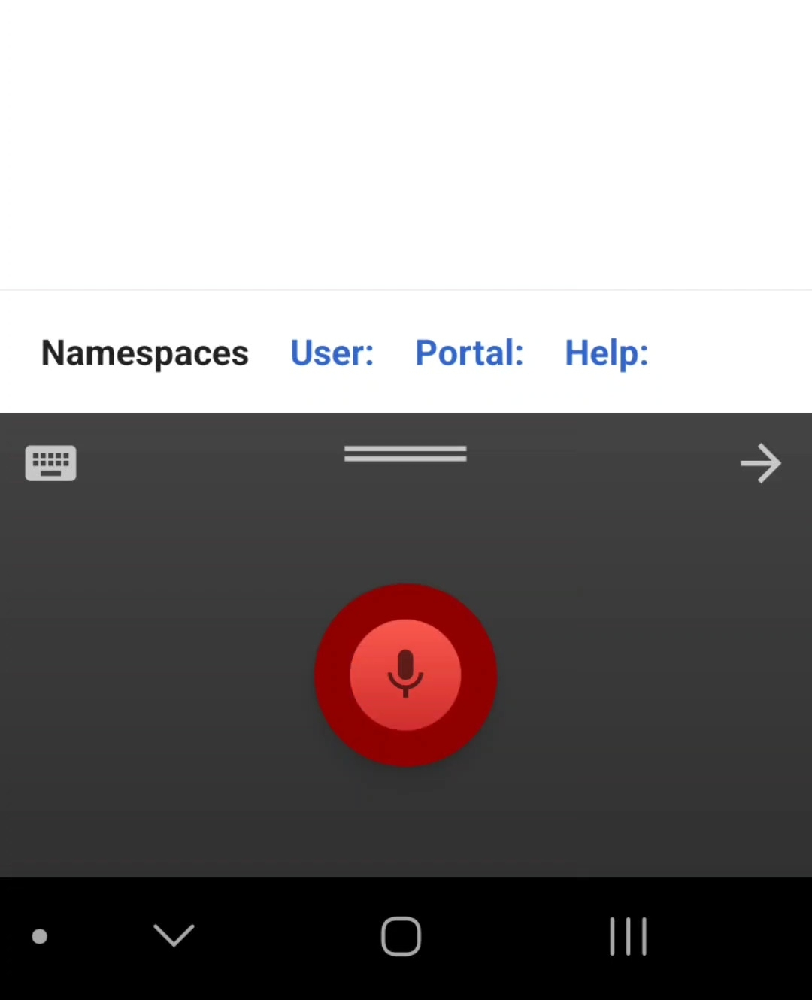
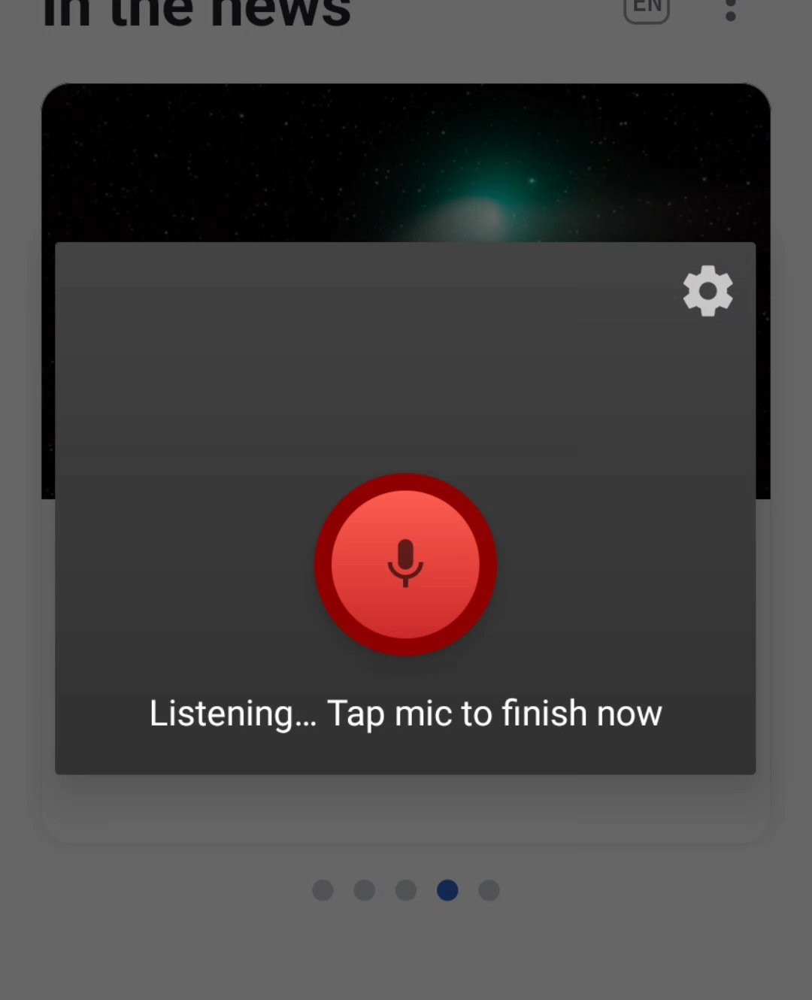

# WhisperInput

Offline voice input panel & keyboard with punctuation for Android, experimental, powered by Whisper AI & Kõnele components.

[](example/example_1.jpg)
[](example/example_2.jpg)

Voice input is supported in English.


# Features

* Works as a voice keyboard (input method editor), a voice input panel, or an assistant app.
* On-device speech recognition, offline.
* Auto-start, auto-stop, audio cue option.


## Installation

Requirements: Java, Android SDK.

Run: 
```
git clone https://github.com/alex-vt/WhisperInput.git
cd WhisperInput/
./gradlew assembleRelease
```
Install `app/build/outputs/apk/release/app-release.apk` on Android device.


## Underlying projects

* [Kõnele](https://github.com/Kaljurand/K6nele), a voice inputs integration app for Android, by Kaljurand, Apache-2.0 license
* [speechutils](https://github.com/Kaljurand/speechutils), a voice recognition library for Android, by Kaljurand, Apache-2.0 license
* [whisper.cpp](https://github.com/ggerganov/whisper.cpp), a performance-tuned build of a speech model, by ggerganov, MIT license
* [whisper](https://github.com/openai/whisper), a speech model, by OpenAI, MIT license


## License

[MIT license](LICENSE)
